# Decision Flowchart: C++/OpenMP vs Rust for Multicore Systems

> **How to use this flowchart:**
> Walk through each question from top to bottom. Answer based on your system's requirements.
> Each terminal outcome cites which benchmark provides the supporting evidence.
> Nodes marked **[TBD]** will be updated as Benchmarks 2–4 are completed.

---

## Flowchart

```mermaid
flowchart TD
    START(["🏁 You need to build a multicore system.\nTwo options: C++ with OpenMP  |  Rust std::thread\nStart here."])
    START --> Q1

    Q1{"Q1 — Safety requirement\n\nIs freedom from data races\nor memory safety a\nnon-negotiable requirement?\n\neg. financial systems, medical,\nsafety-critical infrastructure"}
    Q1 -- Yes --> RUST_SAFE

    RUST_SAFE(["✅ Choose Rust\n\nThe Rust compiler enforces memory\nsafety and prevents data races\nat compile time — no runtime\ncost, no sanitizer needed.\n\nOpenMP offers no such guarantee.\nRace conditions are possible and\nsilent at compile time."])

    Q1 -- No --> Q2

    Q2{"Q2 — Workload shape\n\nWhat best describes your\nprimary parallel workload?"}

    Q2 -- "Loop-parallel or data-parallel\neg. array operations, matrix math,\nsimulations with uniform work" --> Q3
    Q2 -- "Irregular or dynamic\neg. graph algorithms, tree traversal,\ntask sizes that vary at runtime" --> Q4

    Q3{"Q3 — Synchronization frequency\n\nHow often does your code\nenter and exit parallel regions?\n\neg. Is the parallel body large\n(milliseconds of work each time)\nor tiny and repeated millions\nof times per second?"}

    Q3 -- "High frequency —\nfine-grained fork/join,\nmillions of regions per second" --> OPENMP_OVERHEAD

    OPENMP_OVERHEAD(["✅ Choose OpenMP\n\nBenchmark 1 result (crunchy5, 1–32T):\nOpenMP fork/join overhead:\n  1T:  4.8 µs   Rust: 6.2 µs  → 1.3×\n  2T:  6.2 µs   Rust: 19.3 µs → 3.1×\n  4T:  5.2 µs   Rust: 36.2 µs → 7.0×\n  8T:  6.1 µs   Rust: 62.0 µs → 10.1×\n  16T: 8.9 µs   Rust: 126 µs  → 14.1×\n  32T: 18.1 µs  Rust: ~343 µs → ~19×\n\nOpenMP threads spin-wait between\nregions — wake-up is nearly free.\nRust Barrier uses condvar + OS\nsyscall — latency scales with T.\n\nAt fine-grained parallelism,\nthis gap dominates total runtime."])

    Q3 -- "Low frequency —\ncoarse-grained bodies,\nthe parallel work itself\ntakes most of the time" --> Q5

    Q4{"Q4 — Scheduling needs\n\nIs OpenMP's built-in scheduling\nsufficient for your workload?\n\nschedule static  — fixed chunks\nschedule dynamic — work queue\nschedule guided  — shrinking chunks"}

    Q4 -- "Yes — one of those\ncovers my use case" --> OPENMP_SCHED

    OPENMP_SCHED(["✅ Likely OpenMP\n\nOpenMP schedule clauses handle\ncommon load-balancing patterns\nwith a single pragma.\n\nBenchmark 4 (prime testing, N=1M):\n  Dynamic vs static speedup:\n  4T:  1.52× (OMP), 1.35× (Rust)\n  8T:  1.39× (OMP), 1.38× (Rust)\n  32T: 1.29× (OMP), 1.48× (Rust)\n  Benefit is consistent and equal\n  across both languages.\n\n  Scheduling gap: 38–40%\n  Language gap (same schedule): 0–4%\n\nRust equivalent requires\n  Arc<AtomicU64> + fetch_add (~15 lines)\nRayon is 1 line but regresses at 64T\n  (2.0× behind OMP dynamic).\n\nAt 1T–32T: Rust dynamic ≈ OMP dynamic\n  (within 2–4%). Same perf, more code."])

    Q4 -- "No — I need custom\ntask priorities, stealing,\nor non-standard partitioning" --> RUST_SCHED

    RUST_SCHED(["✅ Choose Rust\n\nRust gives full programmer control\nover thread lifecycle and work\ndistribution. You can implement\nany scheduling strategy explicitly.\n\nOpenMP exposes no API to control\nthe internal thread pool or\nimplement custom scheduling.\n\nBenchmark 4 confirms:\n  Rust dynamic (Arc<AtomicU64>)\n  matches OMP dynamic at 1T–32T:\n    ratio = 0.97–1.04×\n  At 32T Rust dynamic (0.016s)\n  is 3% FASTER than OMP (0.017s).\n\n  Rayon par_iter matches OMP\n  dynamic at 1T–16T (1.01–1.07×)\n  but at 64T Rayon (0.024s) is\n  slower than Rust static (0.017s).\n  Explicit AtomicU64: 1.16× at 64T.\n\nFor custom priorities, non-standard\npartitioning, or explicit lifecycle\ncontrol: Rust is the only option.\nOpenMP cannot expose its internals."])

    Q5{"Q5 — Reduction workloads\n\nDoes your workload involve\nheavy reduction patterns?\n\neg. summing across threads,\nbuilding a shared histogram,\naccumulating partial results"}

    Q5 -- Yes --> Q5A
    Q5 -- No --> Q6

    Q5A{"Q5A — What matters more\nfor your team?\n\nImplementation speed and\nconciseness\n  vs\nExplicit control and\nlong-term auditability"}

    Q5A -- "Speed and conciseness" --> OPENMP_REDUCE

    OPENMP_REDUCE(["✅ Likely OpenMP\n\nOpenMP expresses array reduction\nwith a single clause:\n  reduction(+: h[:bins])\n\nThe runtime automatically creates\nprivate copies per thread, lets\nthreads write contention-free,\nthen merges at the end.\nThe programmer writes nothing extra.\n\nBenchmark 3 (histogram, N=2²⁶,\n256 bins, Strategy A):\n  1T–16T: tie with Rust (< 2% diff)\n  32T: OpenMP 5% faster\n  64T: OpenMP 12% faster (thread pool)\n  Both scale at 98–100% efficiency\n  from 1T to 16T.\n\nRust requires ~10 extra lines:\nexplicit private Vec per thread,\nexplicit partition, explicit merge."])

    Q5A -- "Explicit control\nand auditability" --> RUST_REDUCE

    RUST_REDUCE(["✅ Likely Rust\n\nRust forces the programmer to\nexplicitly state what is shared,\nwhat is private, and how\nresults are combined.\n\nFor histogram reduction:\n  allocate Vec<u64> per thread\n  each thread fills its own copy\n  explicit merge loop after join\n\nThe borrow checker verifies at\ncompile time that no thread\naccesses another thread's private\nhistogram. No hidden sharing.\n\nBenchmark 3 confirms: same\nperformance as OpenMP at 1T–16T.\nTrade-off is ~10 extra lines of\ncode for full auditability and\ncompile-time safety guarantees."])

    Q6{"Q6 — Scalability\n\nDoes your system need to scale\nto many cores efficiently?\n\neg. Will you run at 16, 32,\nor more threads and expect\nnear-linear speedup?"}

    Q6 -- "Yes — scalability\nis a primary concern" --> Q6A

    Q6A{"Q6A — What limits\nyour scalability?\n\nSynchronization overhead\n  vs\nLoad imbalance"}

    Q6A -- "Synchronization overhead\nis the bottleneck" --> OPENMP_SCALE

    OPENMP_SCALE(["✅ Likely OpenMP\n\nBenchmark 1 (crunchy5, 1–32T):\nBarrier overhead — OMP vs Rust:\n  1T:  3.0 µs vs 3.0 µs  → 1.0× (tied)\n  2T:  3.7 µs vs 9.6 µs  → 2.6×\n  4T:  2.1 µs vs 18.0 µs → 8.5×\n  8T:  2.3 µs vs 29.4 µs → 12.8×\n  16T: 4.4 µs vs 62.0 µs → 14.2×\n  32T: 9.4 µs vs ~130 µs → 13.8×\n\nOMP barrier plateaus at 13–14×\nadvantage from 8T onward.\nRust condvar-based Barrier\nscales linearly with thread count.\n\nBenchmark 2-1 (popcount, N=2³³):\nAt 64 threads, OpenMP is 4% faster\nthan Rust despite a slower inner\nloop — OpenMP's persistent thread\npool wakes up instantly while Rust\nspawns 64 fresh OS threads each\ntrial (~3 ms overhead per run).\n\nCrossover: 32T→64T, where per-thread\nwork drops to ~250 ms and thread\nmanagement overhead becomes visible."])

    Q6A -- "Load imbalance\nis the bottleneck" --> OPENMP_SCHED

    Q6 -- "No — moderate scale,\nscalability is not\nthe dominant concern" --> Q7

    Q7{"Q7 — Team and timeline\n\nWhat is your team's situation?"}

    Q7 -- "Team is already in C/C++\nand timeline is tight" --> OPENMP_TEAM

    OPENMP_TEAM(["✅ Likely OpenMP\n\nOpenMP adds parallelism to\nexisting C/C++ code with minimal\nnew concepts. Ramp-up is low\nfor a C/C++ team.\n\nBenchmark 1 implementation:\n  OpenMP: 218 lines\n  Rust:   313 lines\n\nOpenMP required 3 pragmas.\nRust required designing a\nfull thread pool from scratch."])

    Q7 -- "Team is new to both\nor long-term investment\nis acceptable" --> Q8

    Q8{"Q8 — Time horizon\n\nHow long will this codebase live\nand how many people will\nwork on it?"}

    Q8 -- "Short-lived prototype\nor small team, speed matters" --> OPENMP_PROTO

    OPENMP_PROTO(["✅ Likely OpenMP\n\nFor short-lived or\nexperimental code, OpenMP's\nlow boilerplate and fast\nresults outweigh its\nlack of safety guarantees."])

    Q8 -- "Long-lived system\nor growing team\ncorrectness matters" --> RUST_FINAL

    RUST_FINAL(["✅ Choose Rust\n\nFor long-lived concurrent systems,\nRust's ownership model pays off:\n\n• Data races caught at compile time\n• Explicit sharing makes code\n  reviews and audits easier\n• Refactoring is safer\n• No need for sanitizers or\n  careful documentation of\n  shared/private variables\n\nHigher upfront cost,\nstronger long-term guarantees."])
```

---

## Evidence Map

Each decision node in the flowchart is informed by one or more benchmarks.
This table will be filled in as benchmarks are completed.

| Question | Key metric | Benchmark | Status |
|---|---|---|---|
| Q3 — Sync frequency | Fork/join overhead vs thread count (1–32T) | Benchmark 1 (re-run) | ✅ Complete |
| Q5 — Reduction workloads | Reduction LOC, runtime, correctness effort | Benchmark 3 | ✅ Complete |
| Q6A — Sync overhead at scale | Barrier cost 1–32T, speedup curves | Benchmark 1 (re-run) + 2-1 | ✅ Complete |
| Q6A — Load imbalance | Runtime under uneven work, scheduling | Benchmark 4 | ✅ Complete |
| Q4 — Custom scheduling | LOC, flexibility, runtime comparison | Benchmark 4 | ✅ Complete |
| Q6 — Scalability | Speedup and efficiency vs thread count | Benchmark 2-1 | ✅ Complete |

---

## Key Findings (Benchmark 1 — Thread Overhead)

These facts are established from the thread overhead microbenchmark (fork/join, barrier, atomic, 1–32 threads, crunchy5 early-morning low-load run):

1. **OpenMP fork/join overhead is 1.3–19× lower than Rust** from 1T to 32T, with the gap growing with thread count.
   1T: 4.8 µs vs 6.2 µs (1.3×) — 2T: 6.2 µs vs 19.3 µs (3.1×) — 4T: 5.2 µs vs 36.2 µs (7.0×) — 8T: 6.1 µs vs 62.0 µs (10.1×) — 16T: 8.9 µs vs 126 µs (14.1×) — 32T: 18.1 µs vs ~343 µs (~19×).
   OpenMP: 3.8× growth from 1T to 32T. Rust: ~55× growth.
   → Drives Q3: if sync frequency is high, OpenMP wins. The gap is decisive and grows monotonically.

2. **Barrier overhead is equal at 1 thread, then diverges sharply and plateaus.**
   1T: tied (~3.0 µs each). 2T: 2.6×. 4T: 8.5×. 8T: 12.8×. 16T: 14.2×. 32T: 13.8×.
   OpenMP barrier: 2.1–9.4 µs (1T–32T). Rust barrier: 3.0–130 µs.
   Ratio plateaus at ~14× from 8T onward — both scale, but with a stable ~14× cost multiplier.
   → Reinforces Q6A: if synchronization is the bottleneck, OpenMP scales better by ~14× at 8T+.

3. **Atomic increment cost is essentially identical** (38–107 ns OMP, 47–103 ns Rust, no consistent winner at any thread count).
   → Neither language has an advantage on hardware atomics.

4. **OpenMP provides no programmer control over thread lifecycle.**
   You cannot force thread creation or destruction between regions.
   → Drives Q4: if custom scheduling or lifecycle control is needed, OpenMP cannot do it.

5. **Rust required 95 more lines of code** and a full thread pool design for an equivalent benchmark.
   → Drives Q7/Q8: for rapid development, OpenMP wins on productivity.

6. **Rust's borrow checker caught all sharing bugs at compile time.** No runtime debugging needed.
   → Drives Q1/Q8: for safety-critical or long-lived systems, Rust's upfront cost is justified.

7. **OMP's persistent spin-pool produces 0 contaminated cells across all B1 trials.** Rust's condvar-based barrier produced contaminated cells even in low-load conditions at T=16 and T=32 (2–3 out of 5 trials). When threads sleep, OS scheduler preemptions can stall the entire barrier.
   → Reinforces Q3: OpenMP's spin-waiting is a reliability advantage on shared hardware, not just a latency advantage.

---

## Key Findings (Benchmark 2 — Monte Carlo Pi)

These facts are established from the Monte Carlo Pi benchmark (Xorshift64 RNG, 1B samples, 1–64 threads):

7. **RNG choice introduced a 3× artificial performance gap.** The original comparison used mt19937_64 (C++ stdlib) vs Xorshift64 (Rust). Unifying both to Xorshift64 collapsed the gap to ~1.35×. Confounding factors in the inner loop must be eliminated before comparing parallel models.
   → Lesson: benchmark design determines what you are actually measuring. A 3× gap from RNG choice was masking the true parallelism comparison.

8. **With unified RNG, OpenMP is ~1.35× faster at all thread counts — a constant multiplier.**
   A constant ratio across all thread counts means the difference is entirely in single-thread code generation (Xorshift64's sequential dependency chain preventing SIMD), not in parallelism quality. Both models scale at the same rate.
   → Precursor to Benchmark 2-1: the FP and RNG inner loop must be replaced with a bias-free workload to isolate the parallelism model.

---

## Key Findings (Benchmark 2-1 — Embarrassingly Parallel Scalability, Popcount)

These facts are established from the popcount benchmark (N = 2³³, 1–64 threads, both implementations clean):

9. **Both OpenMP and Rust scale at near-identical efficiency for compute-bound embarrassingly parallel work.**
   Both reach 97–100% parallel efficiency from 1T to 16T. Neither parallelism model has a structural scalability advantage when synchronization is absent.
   → Q6 confirmed: if scalability is the concern, the decision must be made on other axes.

10. **Rust/LLVM is ~1.13–1.15× faster than C++/GCC from 1T to 16T.**
    The gap is a **constant multiplier** — it does not change as thread count scales. This proves the difference is in single-thread code generation (LLVM's 8× loop unrolling vs GCC's scalar loop), not in the parallelism model.
    → Reinforces Q7/Q8: LLVM produces better code for this workload, but this does not affect the parallel scaling decision.

11. **At 64 threads, OpenMP reverses the advantage and runs 4% faster than Rust.**
    With 64 threads each doing only ~250ms of compute, Rust's cost of spawning 64 fresh OS threads per trial (~3ms total) erases its inner-loop speed advantage. OpenMP's persistent thread pool wakes up at nearly zero cost.
    → Reinforces Q3: fine-grained or high-thread-count parallelism favors OpenMP's thread pool model.

12. **Neither compiler uses AVX2 SIMD for popcount on crunchy.**
    AVX-512 VPOPCNTDQ is not available on the cluster. Both binaries use scalar `popcnt`. LLVM's advantage comes from 8× loop unrolling and multiple accumulators, not SIMD width.

---

## Key Findings (Benchmark 2-2 — Rayon vs std::thread)

These facts are established from repeating the popcount benchmark with Rayon (N = 2³³, 1–64 threads):

13. **Switching from bare `std::thread` to Rayon does not fix the 64T reversal — it makes it larger.**
    OpenMP leads Rayon by 7.5% at 64T vs only 4% over std::thread. Rayon's work-stealing bookkeeping across 64 workers compounds the thread management overhead.
    → The 64T reversal is not caused by thread spawn cost alone; it is a structural property of OpenMP's persistent pool vs any fresh-thread or work-stealing model.

14. **For uniform workloads, bare `std::thread` with static partitioning beats Rayon.**
    std::thread is 3–5% faster than Rayon at every thread count from 1T to 32T. LLVM generates an 8× unrolled loop inside the bare thread closure vs only 4× inside Rayon's work-stealing closure. Work-stealing adds scheduler overhead that buys nothing when every element costs the same.
    → Rayon's advantage is for **irregular** workloads where load imbalance exists. For perfectly uniform work, static partitioning is always better.

15. **The performance ranking for uniform workloads is: std::thread > Rayon > OpenMP (1T–32T); OpenMP > std::thread > Rayon (64T).**
    All three scale at equivalent efficiency. The differences are in single-thread code quality and thread management overhead, not in parallelism model quality.

---

## Key Findings (Benchmark 3 — Parallel Histogram, Reduction Workloads)

These facts are established from the histogram benchmark (N = 2²⁶, 256 bins, Strategy A, 1–64 threads):

16. **Algorithm design matters more than language choice.**
    Strategy B (shared atomics) made performance 4× *worse* at 64 threads. Strategy A (private histograms + merge) gives 35× speedup at 64T. Choosing the right reduction pattern is the first decision — language comes second.

17. **Performance is a tie at 1T–16T.** OpenMP and Rust differ by less than 2% at every thread count from 1T to 16T. Both scale at 98–100% parallel efficiency. The Q5A decision is entirely about code, not runtime.
    → Q5A confirmed: the choice between OpenMP and Rust for reduction workloads is a programmability decision, not a performance decision.

18. **OpenMP's `reduction` clause expresses the entire pattern in one line.**
    The programmer writes a serial-looking loop; the runtime handles private allocation, contention-free writes, and merge invisibly. Rust requires ~10 explicit lines for the same behavior.
    → Drives `OPENMP_REDUCE`: for teams that prioritize conciseness and development speed, OpenMP wins on this axis.

19. **Rust's explicit model gives compile-time auditability.**
    Every decision is visible: what each thread owns, what it writes, and when the merge happens. The borrow checker verifies at compile time that no thread accesses another's private data.
    → Drives `RUST_REDUCE`: for long-lived systems where correctness and code review clarity matter, Rust's verbosity is a feature.

20. **The 32T→64T cliff is a memory bandwidth wall, not a parallelism problem.**
    Both languages collapse from ~94% efficiency at 32T to ~50% at 64T. The 256MB input array saturates memory bandwidth at ~32 threads. This is a hardware constraint that neither language can overcome.

---

## Key Findings (Benchmark 4 — Irregular Workload, Prime Testing)

These facts are established from the prime testing benchmark (N = 1,000,000, 5 strategies, 1–64 threads):

21. **Static scheduling has identical load-imbalance penalty in both languages.**
    With clean data (early-morning low-load run), Rust static and OMP static track each other within ±11% at every thread count:
      8T:  OMP static = 0.077s, Rust static = 0.077s (tied exactly)
      64T: OMP static = 0.018s, Rust static = 0.017s (Rust 6% faster)
    Both achieve 43% parallel efficiency at 64T. The load imbalance bottleneck is a property of the algorithm, not the language.
    → Confirms Q6A: for irregular workloads, static scheduling is the wrong choice regardless of language.

22. **Dynamic scheduling delivers 1.3–1.5× speedup over static, identically in both languages.**
    OMP dynamic/static: 1.52× at 4T, 1.39× at 8T, 1.29× at 32T.
    Rust dynamic/static: 1.35× at 4T, 1.38× at 8T, 1.48× at 32T.
    The benefit is consistent and nearly equal between languages. Scheduling mechanism (pragma vs. AtomicU64) does not change how much imbalance is corrected — only how much code is needed.
    → Confirms Q4 (OPENMP_SCHED): OpenMP's one-keyword change delivers the same benefit as ~15 lines of explicit Rust code.

23. **Rust dynamic matches OMP dynamic within 2–4% from 1T to 32T.**
    Rust dynamic: 0.446s, 0.220s, 0.110s, 0.056s, 0.029s, 0.016s at 1T/2T/4T/8T/16T/32T.
    OMP dynamic:  0.432s, 0.217s, 0.109s, 0.055s, 0.028s, 0.017s at same counts.
    At 32T, Rust dynamic (0.016s) is 3% *faster* than OMP dynamic (0.017s).
    The explicit `Arc<AtomicU64>` counter achieves the same load-balancing effect as OpenMP's internal work queue.
    → Confirms Q4 (RUST_SCHED): Rust can match OMP dynamic, but requires ~15 lines vs. one keyword.

24. **Rayon matches OMP dynamic at 1T–16T (1.01–1.07×), then regresses sharply.**
    Rayon: 0.436s, 0.219s, 0.111s, 0.057s, 0.030s at 1T–16T — within 7% of OMP dynamic.
    At 32T: Rayon = 0.020s vs OMP dynamic 0.017s → 1.18× behind.
    At 64T: Rayon = 0.024s vs OMP dynamic 0.012s → **2.0× behind**.
    At 64T, Rayon (0.024s) is also **41% slower than Rust static (0.017s)** — work-stealing overhead on this 8-NUMA-node machine exceeds any load-balancing benefit at N=1M, 64T.
    → Nuance for Q4: Rayon is the highest-productivity option at 1T–16T (1 line, near-optimal). Explicit dynamic (AtomicU64) is better at 32T–64T on NUMA hardware.

25. **Scheduling gap (38–40%) vastly exceeds language gap (0–4%).**
    At 8T (fully clean, all 5 strategies populated):
      OMP dynamic: 0.055s (best)
      Rust dynamic: 0.056s (1.02× — language gap)
      Rust rayon:  0.057s (1.04× — language gap)
      OMP static:  0.077s (1.40× — scheduling gap)
      Rust static: 0.077s (1.40× — scheduling gap, same as OMP!)
    The scheduling gap (40%) is ~10× the language gap (2–4%). For irregular workloads: choose the schedule first, the language second.
    → Reinforces Q4 over Q7/Q8.

26. **Previously anomalous Rust static 64T results were cluster load, not NUMA.**
    Earlier runs showed Rust static 64T = 0.165–0.304s (all 5 trials, 10–17× slower than expected).
    Early-morning low-load run 2 shows Rust static 64T = **0.017s** (five trials: 0.017, 0.017, 0.017, 0.017, 0.018).
    This definitively rules out NUMA effects or structural load imbalance as the cause — both are reproducible properties that would persist even at low cluster load. The anomaly was pure cluster interference.
    OpenMP's persistent pool produced 0 contaminated cells in all runs. Rust's fresh-thread spawning is more sensitive to cluster load, but produces identical performance when the cluster is quiet.
    → Reinforces Q3: OpenMP's persistent pool is a reliability advantage on shared hardware, not just a latency advantage.

---

## How to Read the Final Outcome

The flowchart will rarely give a perfect one-sided answer. In practice:

- If multiple paths point to **OpenMP** → OpenMP is the right fit for your system.
- If multiple paths point to **Rust** → Rust is the right fit.
- If paths are mixed → read the cited benchmark numbers for your specific bottleneck and weight the decision toward whichever axis matters most for your system.

The flowchart is a structured way to surface the right trade-off questions, not a mechanical oracle.
