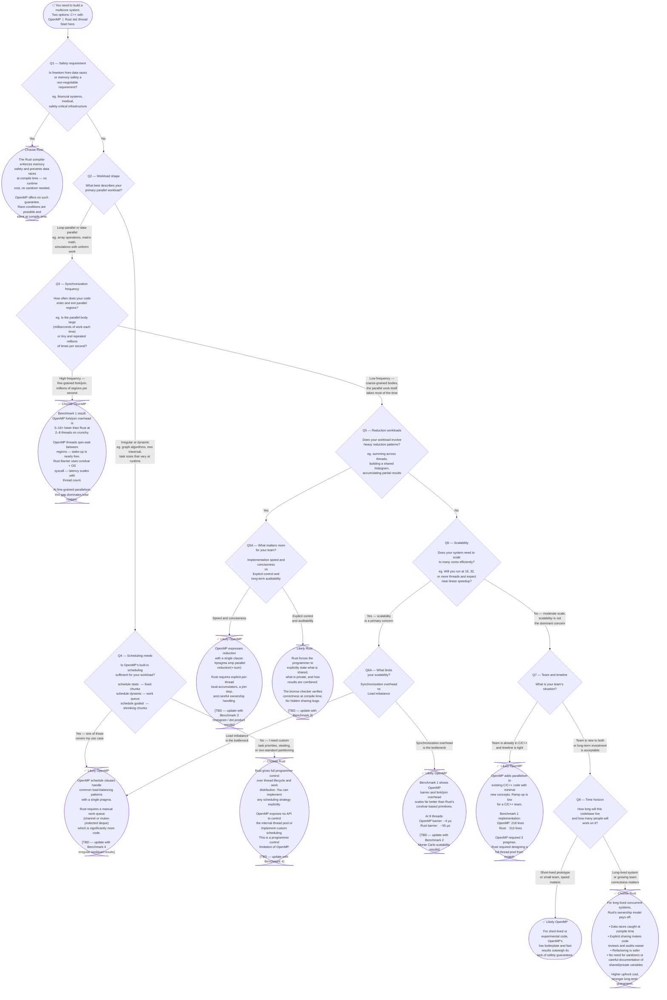

# Decision Flowchart: C++/OpenMP vs Rust for Multicore Systems

> **How to use this flowchart:**
> Walk through each question from top to bottom. Answer based on your system's requirements.
> Each terminal outcome cites which benchmark provides the supporting evidence.
> Nodes marked **[TBD]** will be updated as Benchmarks 2–4 are completed.

---

## Flowchart

---

## Evidence Map

Each decision node in the flowchart is informed by one or more benchmarks.
This table will be filled in as benchmarks are completed.

| Question | Key metric | Benchmark | Status |
|---|---|---|---|
| Q3 — Sync frequency | Fork/join overhead vs thread count | Benchmark 1 | ✅ Complete |
| Q5 — Reduction workloads | Reduction LOC, runtime, correctness effort | Benchmark 3 | 🔲 Pending |
| Q6A — Sync overhead at scale | Barrier cost, speedup curves | Benchmark 1 + 2 | ⚠️ Partial |
| Q6A — Load imbalance | Runtime under uneven work, scheduling | Benchmark 4 | 🔲 Pending |
| Q4 — Custom scheduling | LOC, flexibility, runtime comparison | Benchmark 4 | 🔲 Pending |
| Q6 — Scalability | Speedup and efficiency vs thread count | Benchmark 2 | 🔲 Pending |

---

## Key Findings So Far (Benchmark 1)

These facts are established and directly feed into the flowchart:

1. **OpenMP fork/join overhead is 5–16× lower than Rust** at 2–8 threads.
   → Drives Q3: if sync frequency is high, OpenMP wins.

2. **Barrier overhead is equal at 1 thread, then diverges sharply.**
   OpenMP: ~2–4 µs. Rust: ~16–55 µs at 2–8 threads.
   → Reinforces Q6A: if synchronization is the bottleneck, OpenMP scales better.

3. **Atomic increment cost is identical** (~24–102 ns on both sides, within noise).
   → Neither language has an advantage on hardware atomics.

4. **OpenMP provides no programmer control over thread lifecycle.**
   You cannot force thread creation or destruction between regions.
   → Drives Q4: if custom scheduling or lifecycle control is needed, OpenMP cannot do it.

5. **Rust required 95 more lines of code** and a full thread pool design for an equivalent benchmark.
   → Drives Q7/Q8: for rapid development, OpenMP wins on productivity.

6. **Rust's borrow checker caught all sharing bugs at compile time.** No runtime debugging needed.
   → Drives Q1/Q8: for safety-critical or long-lived systems, Rust's upfront cost is justified.

---

## How to Read the Final Outcome

The flowchart will rarely give a perfect one-sided answer. In practice:

- If multiple paths point to **OpenMP** → OpenMP is the right fit for your system.
- If multiple paths point to **Rust** → Rust is the right fit.
- If paths are mixed → read the cited benchmark numbers for your specific bottleneck and weight the decision toward whichever axis matters most for your system.

The flowchart is a structured way to surface the right trade-off questions, not a mechanical oracle.
